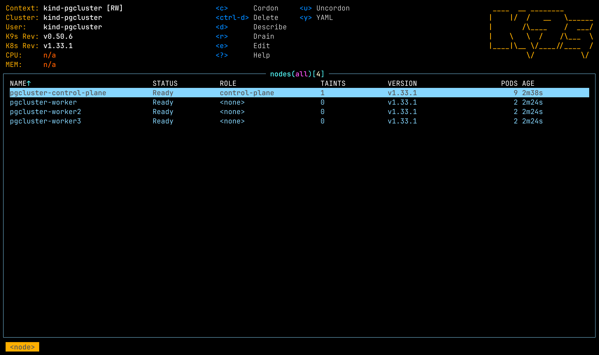
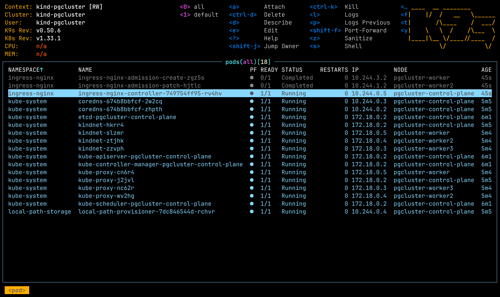
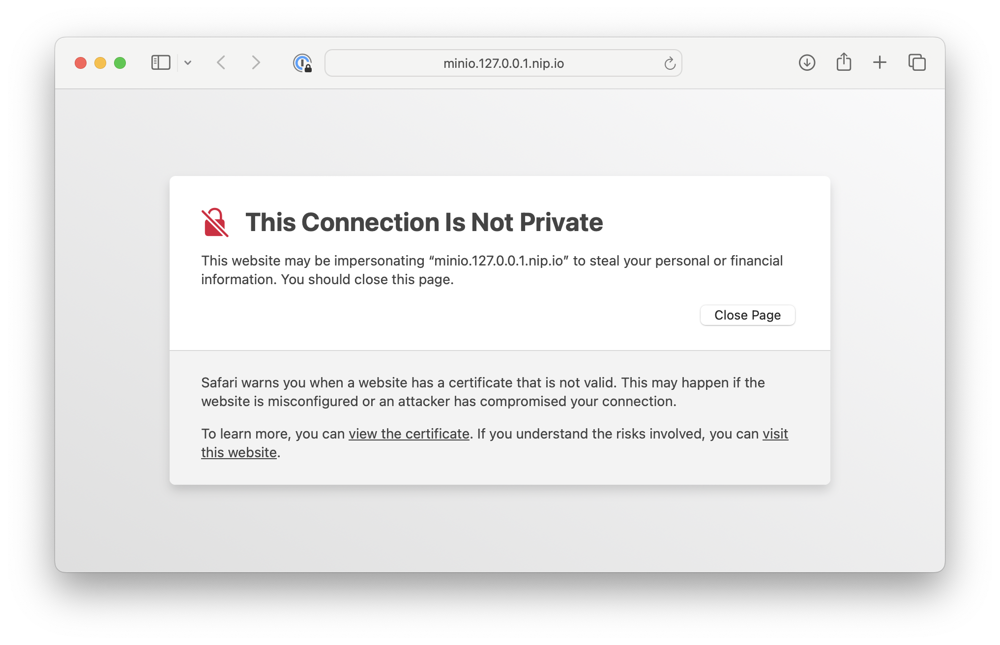
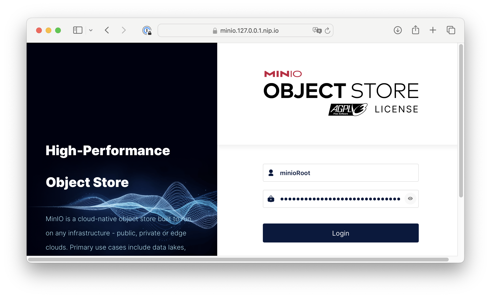

# EnterpriseDB Operator Workshop

## Install dependencies

Use your package manager to install kind, kubectl, kubectl-cnpg, k9s and sqlelectron.
Then we create a quick script that will write secrets in an `.env` file that can be sourced
for secrets.

```sh
brew install kind derailed/k9s/k9s kubectl-cnpg helm kubectl sqlelctron tmus watch
cat <<'EOF' | tee generate_env.sh
#!/bin/bash

# Function to generate a random string
generate_random_string() {
    local LENGTH=$1
    LC_ALL=C tr -dc A-Za-z0-9 </dev/urandom | head -c $LENGTH ; echo ''
}

# Generate secrets
GRAFANA_ADMIN_PASSWORD=$(generate_random_string 30)
MINIO_ROOT_PASSWORD=$(generate_random_string 30)
MINIO_USER_PASSWORD=$(generate_random_string 30)
MINIO_ACCESS_KEY=$(generate_random_string 20)
MINIO_SECRET_KEY=$(generate_random_string 40)
POSTGRES_PASSWORD=$(generate_random_string 30)
APPDBROOT_PASSWORD=$(generate_random_string 30)

# Create the .env file and write the environment variables to it
cat <<EOL > .env
# Prometheus & Grafana configuration
GRAFANA_ADMIN_PASSWORD=$GRAFANA_ADMIN_PASSWORD

# MinIO configuration
MINIO_ROOT_PASSWORD=$MINIO_ROOT_PASSWORD
MINIO_USER_PASSWORD=$MINIO_USER_PASSWORD
MINIO_ACCESS_KEY=$MINIO_ACCESS_KEY
MINIO_SECRET_KEY=$MINIO_SECRET_KEY

# PostgreSQL configuration
POSTGRES_PASSWORD=$POSTGRES_PASSWORD
export APPDBROOT_PASSWORD=$APPDBROOT_PASSWORD
EOL

echo ".env file created successfully"
EOF

chmod +x generate_env.sh
./generate_env.sh

helm repo add minio https://charts.min.io/
helm repo add prometheus-community https://prometheus-community.github.io/helm-charts
helm repo add cnpg-grafana https://cloudnative-pg.github.io/grafana-dashboards
helm repo add stable https://charts.helm.sh/stable
helm repo update

```

## Setup Kubernetes Cluster with kind

This setup will create a 3 worker node Kubernetes cluster with `kind`. The aim here is to demonstrate later, how Kubernetes will automatically fail over PostgreSQL and how standby nodes will take over.

```sh
kind delete cluster -n pgcluster
cat <<EOF | kind create cluster --config=-
kind: Cluster
apiVersion: kind.x-k8s.io/v1alpha4
name: pgcluster
nodes:
- role: control-plane
  kubeadmConfigPatches:
  - |
    kind: InitConfiguration
    nodeRegistration:
      kubeletExtraArgs:
        node-labels: "ingress-ready=true"
  extraPortMappings:
  - containerPort: 80
    hostPort: 80
    listenAddress: "0.0.0.0"
    protocol: TCP
  - containerPort: 443
    hostPort: 443
    listenAddress: "0.0.0.0"
    protocol: TCP
  - containerPort: 32432         # PostgreSQL
    hostPort: 5432
    listenAddress: "0.0.0.0"
    protocol: TCP
  - containerPort: 31000         # Grafana
    hostPort: 8080
    listenAddress: "0.0.0.0"
    protocol: TCP
  - hostPort: 8081             # Prometheus
    containerPort: 30000
    listenAddress: "0.0.0.0"
    protocol: TCP
  - containerPort: 32000         # AlertManager
    hostPort: 8082
    listenAddress: "0.0.0.0"
    protocol: TCP
- role: worker
- role: worker
- role: worker
EOF
kubectl cluster-info --context kind-pgcluster
kubectl get nodes -A
```



## Setup NGINX Ingress Controller

To being able to access the deployed services from outside the cluster, a ingress controller is required.
The http services can be configured using different `nip.io` based hostnames on port 443. PostgreSQL is exposed on 5432.

```sh
kubectl apply -f https://raw.githubusercontent.com/kubernetes/ingress-nginx/main/deploy/static/provider/kind/deploy.yaml
kubectl wait --namespace ingress-nginx \
  --for=condition=ready pod \
  --selector=app.kubernetes.io/component=controller \
  --timeout=120s
```

Wait until the `ingress-nginx` pods have completed or are running, e.g. running `k9s -A -c pod`



## Setup Minio

A S3 compatible object storage is required for backup/restore with cloudnativePG. Min.io is installed using its [Community Helm Chart](https://github.com/minio/minio/tree/master/helm/minio).

```sh
source .env
helm upgrade minio minio \
  --install \
  --repo https://charts.min.io/ \
  --namespace minio \
  --create-namespace \
  --set "rootUser=minioRoot,rootPassword=${MINIO_ROOT_PASSWORD},users[0].accessKey=cnpg-backup,users[0].secretKey=${MINIO_USER_PASSWORD},users[0].policy=readwrite,svcaccts[0].accessKey=${MINIO_ACCESS_KEY},svcaccts[0].secretKey=${MINIO_SECRET_KEY},svcaccts[0].user=cnpg-backup,buckets[0].name=cnpg-backup,buckets[0].policy=none,buckets[0].purge=false,replicas=1,resources.requests.memory=512Mi,mode=standalone,consoleIngress.enabled=true,consoleIngress.hosts[0]=minio.127.0.0.1.nip.io"

kubectl rollout status deployment minio --namespace minio --timeout=90s
echo "Login credentials are: minioRoot / ${MINIO_ROOT_PASSWORD}"
open https://minio.127.0.0.1.nip.io/
```


For simplicity reasons, auto-generated self signed certificates are used with the ingress controller. You will have to trust that certificate when accessing with your browser. Click on "visit this website".




## Setup Grafana & Prometheus

Using the Kube-Prometheus-stack Helm chart maintained by the Prometheus Community, we install the [Prometheus Operator](https://github.com/prometheus-community/helm-charts/blob/main/charts/kube-prometheus-stack/values.yaml), including the Alert Manager, and a Grafana deployment.

```sh
source .env
helm upgrade prometheus-community prometheus-community/kube-prometheus-stack \
  --install \
  --namespace monitoring \
  --create-namespace \
  -f https://raw.githubusercontent.com/cloudnative-pg/cloudnative-pg/main/docs/src/samples/monitoring/kube-stack-config.yaml \
  --set "grafana.adminPassword=${GRAFANA_ADMIN_PASSWORD},grafana.defaultDashboardsEnabled=true,grafana.ingress.enabled=true,grafana.ingress.ingressClassName=nginx,grafana.ingress.hosts[0]=grafana.127.0.0.1.nip.io,prometheus.ingress.enabled=true,prometheus.ingress.ingressClassName=nginx,prometheus.ingress.hosts[0]=prometheus.127.0.0.1.nip.io"
kubectl rollout status deployment prometheus-community-grafana --namespace monitoring --timeout=90s
helm upgrade cnpg-grafana-cluster cnpg-grafana/cluster \
  --install \
  --namespace monitoring
echo "Login credentials are: admin / ${GRAFANA_ADMIN_PASSWORD}"
open https://grafana.127.0.0.1.nip.io/d/cloudnative-pg/cloudnativepg
open https://prometheus.127.0.0.1.nip.io/
```

## Preload images to speedup demo

```sh
docker pull ghcr.io/cloudnative-pg/postgresql:16.4
docker pull ghcr.io/cloudnative-pg/postgresql:16.6
kind load docker-image -n pgcluster ghcr.io/cloudnative-pg/postgresql:16.4
kind load docker-image -n pgcluster ghcr.io/cloudnative-pg/postgresql:16.6
```

## Setup cloudnative-PG Kubernetes Operator

Now that we have all requirements setup, we can install the operator that does the heavy lifting of PostgreSQL operations.

```sh
cnpgVersion=$(kubectl cnpg version | awk '{ print $2 }' | awk -F":" '{ print $2}')
kubectl apply --server-side=true -f https://raw.githubusercontent.com/cloudnative-pg/cloudnative-pg/release-${cnpgVersion%.*}/releases/cnpg-${cnpgVersion}.yaml
kubectl rollout status deployment cnpg-controller-manager --namespace cnpg-system --timeout=90s
kubectl get deploy -n cnpg-system cnpg-controller-manager
```


## Setup barmanCloud Backup

```sh
kubectl apply --server-side=true -f https://github.com/cloudnative-pg/plugin-barman-cloud/releases/download/v0.4.0/manifest.yaml
```

## Deploy PostgreSQL demo cluster

```sh
source .env
kubectl create namespace cnpg-demo
kubectl create -n cnpg-demo secret generic minio-creds \
    --from-literal=MINIO_ACCESS_KEY=${MINIO_ACCESS_KEY} \
    --from-literal=MINIO_SECRET_KEY=${MINIO_SECRET_KEY}
kubectl create -n cnpg-demo secret generic pg-cluster-superuser \
    --type="kubernetes.io/basic-auth" \
    --from-literal="username=postgres" \
    --from-literal="password=${POSTGRES_PASSWORD}"
kubectl create -n cnpg-demo secret generic app-db-root \
    --type="kubernetes.io/basic-auth" \
    --from-literal="username=appRoot" \
    --from-literal="password=${APPDBROOT_PASSWORD}"

cat <<EOF | kubectl apply -n cnpg-demo -f -
apiVersion: postgresql.cnpg.io/v1
kind: Cluster
metadata:
  name: pg-cluster
spec:
  instances: 3
  imageName: ghcr.io/cloudnative-pg/postgresql:16.4
  minSyncReplicas: 1
  maxSyncReplicas: 2
  enableSuperuserAccess: true
  superuserSecret:
    name: pg-cluster-superuser
  replicationSlots:
    highAvailability:
      enabled: true
  primaryUpdateStrategy: unsupervised
  primaryUpdateMethod: switchover
  postgresql:
    parameters:
      pg_stat_statements.max: "10000"
      pg_stat_statements.track: all
    pg_hba:
      - host appRoot app all password
      - host postgres postgres all scram-sha-256
  bootstrap:
    initdb:
      database: app
      owner: appRoot
      secret:
        name: app-db-root
  storage:
    size: 1Gi
  walStorage:
    size: 1Gi
  tablespaces:
    - name: idx
      storage:
        size: 1Gi
    - name: tmptbs
      temporary: true
      storage:
        size: 1Gi
  monitoring:
    enablePodMonitor: true
  plugins:
  - name: barman-cloud.cloudnative-pg.io
    isWALArchiver: true
    parameters:
      barmanObjectName: minio-demo

---
apiVersion: barmancloud.cnpg.io/v1
kind: ObjectStore
metadata:
  name: minio-demo
spec:
  configuration:
    destinationPath: s3://cnpg-backups/
    endpointURL: http://minio.minio.svc.cluster.local:9000
    s3Credentials:
      accessKeyId:
        name: minio-eu
        key: MINIO_ACCESS_KEY
      secretAccessKey:
        name: minio-eu
        key: MINIO_SECRET_KEY
      data:
        immediateCheckpoint: true
        compression: gzip
    wal:
      compression: gzip
EOF
```

Kubernetes distributed the 3 instances across the different worker nodes. The operator created one primary and two synchronous standby instances.


Now verify the state of the cluster with the kubectl cnpg plugin

```sh
kubectl cnpg status -n cnpg-demo pg-cluster
```


WAL backup with barman is working as seen in the `Continuous Backup status` section of the status output and in the [Minio Bucket](https://minio.127.0.0.1.nip.io/browser/cnpg-backup/)


## Create a NodePort TCP ingress route to PostgreSQL cluster

```sh
cat <<EOF | kubectl apply -n cnpg-demo -f -
apiVersion: v1
kind: Service
metadata:
  name: pg-cluster-rw-2
spec:
  type: NodePort
  ports:
  - name: tcp-5432
    port: 5432
    nodePort: 32432
    protocol: TCP
  selector:
    cnpg.io/cluster: pg-cluster
    role: primary
EOF
```


go mod init writer
go mod tidy

source .env
go run writer.go


kubectl cnpg backup pg-cluster -n cnpg-demo

kubectl patch cluster pg-cluster -n cnpg-demo --type merge -p '{"spec":{"imageName":"ghcr.io/cloudnative-pg/postgresql:16.5"}}'


primary=$(kubectl -n cnpg-demo get pod -o=jsonpath="{range .items[*]}{.metadata.name}{'\t'}{.status.podIP}{'\t'}{.metadata.labels.role}{'\n'}" | grep primary | awk '{print $1}')
kubectl exec -n cnpg-demo -i ${primary} -- psql < sqltest.sql

\l
\connect app

kubectl-cnpg status pg-cluster

kubectl exec -i cluster-example-1 -- psql < sqltest.sql

kubectl port-forward --namespace default svc/cluster-example-rw 5432:5432 &

kubectl-cnpg promote cluster-example cluster-example-2

kubectl apply -f pgcluster-minorupdate-backup.yaml

cat <<EOF | kubectl replace -n ingress-nginx -f -
apiVersion: v1
kind: Service
metadata:
labels:
app.kubernetes.io/component: controller
app.kubernetes.io/instance: ingress-nginx
app.kubernetes.io/name: ingress-nginx
app.kubernetes.io/part-of: ingress-nginx
app.kubernetes.io/version: 1.10.1
name: ingress-nginx-controller
namespace: ingress-nginx
spec:
ipFamilies:

- IPv4
  ipFamilyPolicy: SingleStack
  type: LoadBalancer
  ports:
- appProtocol: http
  name: http
  port: 80
  protocol: TCP
  targetPort: http
- appProtocol: https
  name: https
  port: 443
  protocol: TCP
  targetPort: https
- name: postgres
  port: 5432
  targetPort: 5432
  protocol: TCP
  selector:
  app.kubernetes.io/component: controller
  app.kubernetes.io/instance: ingress-nginx
  app.kubernetes.io/name: ingress-nginx
  type: NodePort
  EOF
